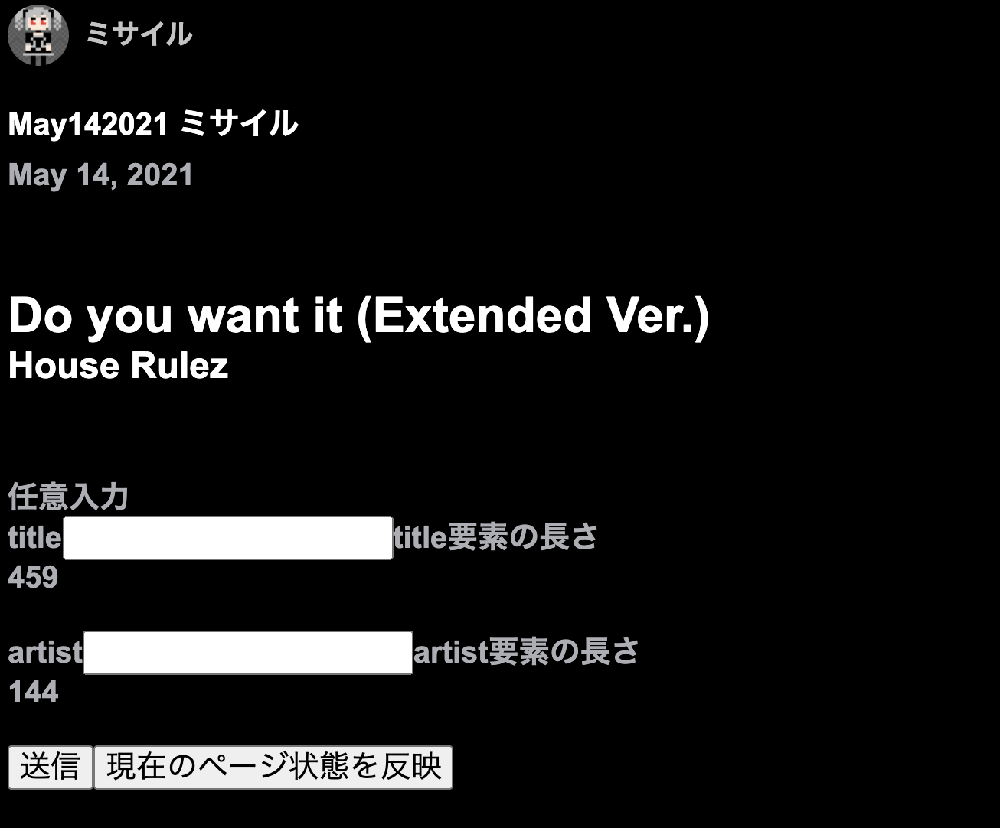

# obs-kuvo-chromeEX-Lite

余計な追加プラグインとか不要な [obs-kuvo-chromeEX](https://github.com/msir3316/obs-kuvo-chromeEX) の簡易版

## 動作確認済み
- Mac OS X Big Sur, OBS Studio (Mac版)
- Windows 10, OBS Studio (Windows版)

## なんでこれ作った？
メイン版の方はなぜかWindowsだとテキストの反映うまくいかないことがあって原因特定できないし、そもそもツールの導入方法が面倒だって意見をもらっているので、もっと簡単に導入できるものを作ろうと思った

## 当ツールの強み
- 他の某ツールはPCDJだと自動反映が遅いが、こちらは基本即時or任意タイミングで反映可能
- 一定以上の長さになるとスクロール機能が有効に、文字の大きさを保ったままそれぞれ１行で表示することが可能
- 上記メイン版は導入が煩雑だが、Lite版はこれを解消

# 目次
1. [導入方法](#how2install)
1. [使い方](#how2use)
1. [曲情報の更新方法](#how2reload)
2. [おすすめの使用方法](#recommended-use)
3. [カスタマイズ](#customize)
4. [連絡先](#contact)

# 導入方法
1. これをgit cloneなどでDLする
1. Chrome拡張の画面を開く
1. 「パッケージ化されていない拡張機能を読み込む」でこれをフォルダごと指定
1. オプションで各種設定

# 使い方
1. rekordboxにて、KUVOのLive PlaylistをSTARTし、何か曲を流す
1. https://kuvo.com/mykuvo/djmix/playlist に新しいプレイリストができるので開く
1. そのプレイリストのページを**一度リロード**する
2. 画像のようなものが出てくる

5. OBSでプレイリストを開いているブラウザを**ウィンドウキャプチャ**する
6. フィルタ設定で、「**カラーキー**」を選び、キー色を**黒**に設定（クロマキーではないので注意）
7. 適切な範囲にトリミング

# 曲情報の更新方法
- 手動の場合: プレイリストのページを直接リロードする
- 自動の場合: オプションで「ページ内容の変化を検知して完全自動で反映」にチェックを入れる
  -  最初に一度リロードして画像の状態にする必要があります
  -  すぐに反映してくれるかはKUVOの機嫌次第です

# おすすめの使用方法
1. カラーキーやトリミングの設定を予めしておき、まずウィンドウキャプチャのソースを非表示にしておく
1. 配信を始める前にまずKUVOをオンにした状態で何か流し、プレイリストページを生成する
2. アクセス＆リロードして、画像の画面を出す
3. 任意入力欄があるので、お好みでテキストを入力
4. ソースを表示する
5. 配信開始、あとはいつものようにDJをしてください

# カスタマイズ
- kuvo.cssを編集してある程度カスタマイズが可能
- カスタマイズした際の動作は保証いたしません

# 連絡先
[Twitter](https://twitter.com/msir3316)
